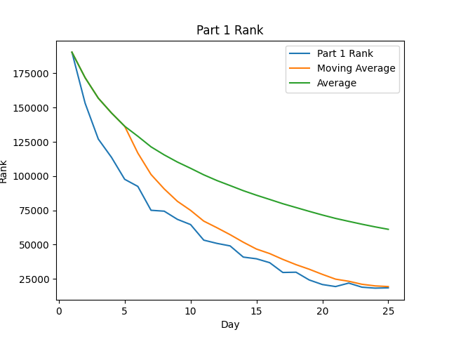
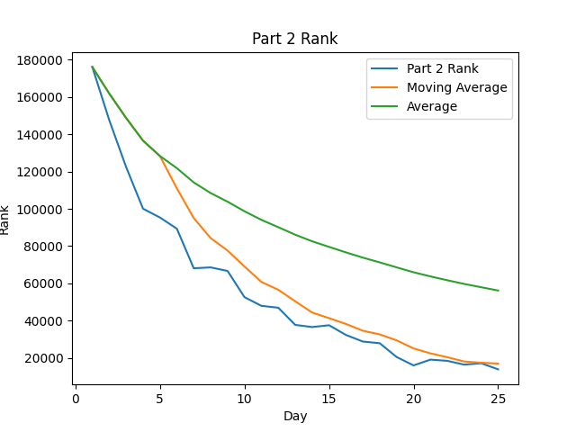
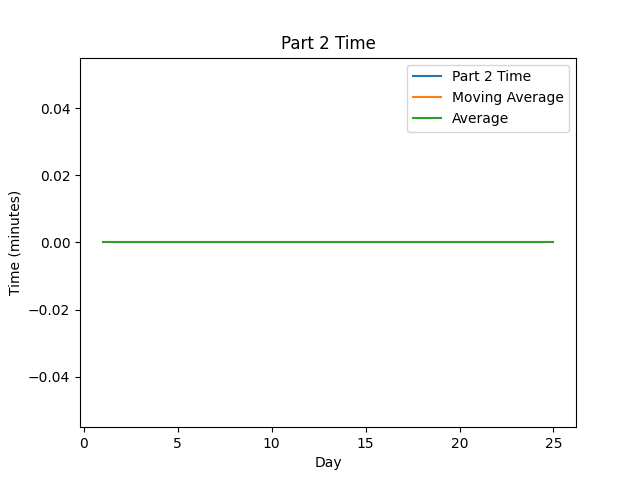

# AoC-Template
[Advent of Code](https://adventofcode.com) Solutions for (YEAR) in (LANGUAGE).

## Highlights:

#### Favorite problems:

* 

#### Interesting approaches:

* 

#### Leaderboard appearances:

* 

## Stats
| Day | Part 1 Time (Rank) | Part 2 Time (Rank) |
| --: | ------------------ | ------------------ |
|   1 | ✅                  | ✅                  |
|   2 | ✅                  | ✅                  |
|   3 | ✅                  | ✅                  |
|   4 | ✅                  | ✅                  |
|   5 | ✅                  | ✅                  |
|   6 | ✅                  | ✅                  |
|   7 | ✅                  | ✅                  |
|   8 | ✅                  | ✅                  |
|   9 | ✅                  | ✅                  |
|  10 | ✅                  | ✅                  |
|  11 | ✅                  | ✅                  |
|  12 | ✅                  | ✅                  |
|  13 | ✅                  | ✅                  |
|  14 | ✅                  | ✅                  |
|  15 | ✅                  | ✅                  |
|  16 | ✅                  | ✅                  |
|  17 | ✅                  | ✅                  |
|  18 | ✅                  | ✅                  |
|  19 | ✅                  | ✅                  |
|  20 | ✅                  | ✅                  |
|  21 | ✅                  | ✅                  |
|  22 | ✅                  | ✅                  |
|  23 | ✅                  | ✅                  |
| 24🎅 | ✅                  | ✅                  |
| 25🎄 | ✅                  | ✅                  |
| Avg | 24:00:00 (61201)   | 24:00:00 (56214)   |

<!--suppress CheckImageSize -->
 
 

Note: Times are from time of challenge release, not start time to completion time

## Scripting initially based on a script from [Ullaakut](https://github.com/Ullaakut/aoc19). Expanded upon and fixed by [HBiede](https://github.com/hbiede)
#### Makefile Automation
* Automatically downloads the challenge and input for the day (e.g.: `make download DAY=03`)
  * In order to use this target, you need to specify your session cookie from adventofcode.com in cookies.txt through the usage of `make cookie SESSION={Insert your session cookie here}`.
  * Parses the challenge into a markdown file (adds Markdown style headers and code blocks).
* Setup the new day's source file from a template file while downloading the input and challenge per above (e.g.: `make DAY=03`)
* Create the stats table above by calling `make stats`
  * May require calling `pip3 install -r requirements.txt` to ensure you have all the necessary python dependencies
